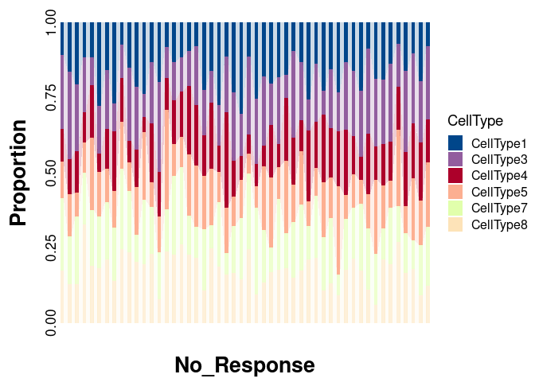
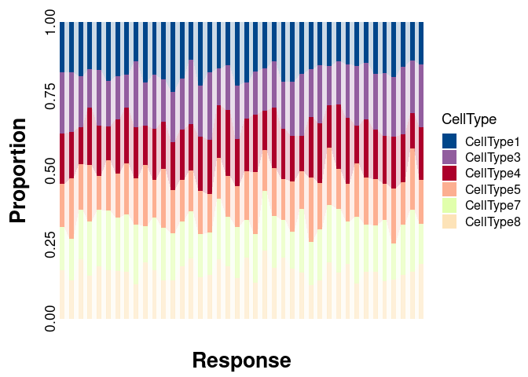
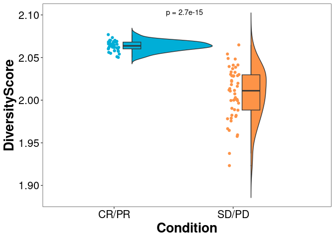

<!-- README.md is generated from README.Rmd. Please edit that file -->

# CellDiv

<!-- badges: start -->
<!-- badges: end -->

The goal of CellDiv is to calculate the Shannon Diversity Index for the
cell types of interest to the user and to allow the identification of
the combination of cell types that best distinguish dichotomous outcomes

## Installation

You can install the development version of CellDiv from
[GitHub](https://github.com/) with:

``` r
# install.packages("devtools")
devtools::install_github("WenqinXie/CellDiv")
```

## Usage

Generate sample data

``` r
#cdata
set.seed(1)
cdata1 <- matrix(sample(1000:5000, 500, replace = TRUE), 50, 10)
row.names(cdata1) <- paste0("A",1:50)
colnames(cdata1) <- c(paste0("CellType", 1:10))
cdata1 <- as.data.frame(cdata1)

set.seed(1)
cdata2 <- matrix(sample(2000:4000, 400, replace = TRUE), 40, 10)
row.names(cdata2) <- paste0("A",1:40)
colnames(cdata2) <- c(paste0("CellType", 1:10))
cdata2 <- as.data.frame(cdata2)

cdata <- rbind(cdata1, cdata2)
print(cdata[1:5, 1:5])
#>    CellType1 CellType2 CellType3 CellType4 CellType5
#> A1      2016      4755      4616      2024      2241
#> A2      4907      1536      1556      1028      4681
#> A3      1678      3422      2684      4661      2217
#> A4      3176      1247      1286      2941      1018
#> A5      1929      2221      3661      1837      1272
```

``` r
#metadata
set.seed(1)
metadata <- data.frame(sample = row.names(cdata),
condition = c(rep("SD/PD", 50), rep("CR/PR", 40)))
metadata$condition <- as.factor(metadata$condition)
print(head(metadata))
#>   sample condition
#> 1     A1     SD/PD
#> 2     A2     SD/PD
#> 3     A3     SD/PD
#> 4     A4     SD/PD
#> 5     A5     SD/PD
#> 6     A6     SD/PD
```

Calculate diversity score for each sample

``` r
library(CellDiv)
divscores <- celltdiv(cdata = cdata, cellsets = colnames(cdata)[1:8])
print(head(divscores))
#>    sample divscore
#> A1     A1 2.023062
#> A2     A2 1.959300
#> A3     A3 1.978922
#> A4     A4 1.937555
#> A5     A5 1.999623
#> A6     A6 2.016300
```

Average AUC values are calculated after multiple samples for all
combinations of cell types of interest

``` r
cdiv <- commroc(cdata = cdata, metadata = metadata, 
        cellsets = colnames(cdata)[1:8], sami = 500, ncores = 10)
print(head(cdiv))
#>     roc.auc             cellsets
#> 1 0.6805325 CellType1; CellType2
#> 2 0.7290725 CellType1; CellType3
#> 3 0.7409187 CellType1; CellType4
#> 4 0.7989425 CellType1; CellType5
#> 5 0.7774863 CellType1; CellType6
#> 6 0.6933512 CellType1; CellType7
```

The combination of cell types corresponding to the maximum AUC value was
selected

``` r
cellsets <- maxroc(acroc = cdiv)
print(cellsets)
#>       roc.auc                                                         cellsets
#> 228 0.9932912 CellType1; CellType3; CellType4; CellType5; CellType7; CellType8
```

Plot relative percentage of cell types

``` r
#"SD/PD"
plotProp(cdata = cdata1, 
         slcells = strsplit(cellsets$cellsets, "; ")[[1]], 
         xtitle = "No_Response",
axistext.x = FALSE, bar_width = 0.5, flow = TRUE, geomtext = FALSE,
color = c("#00468BFF", "#925E9FFF", "#AD002AFF", "#FDAF91FF", "#AFFF1F36", "#FDAF352F"))
```



``` r

#"CR/PR"
plotProp(cdata = cdata2, 
         slcells = strsplit(cellsets$cellsets, "; ")[[1]], 
         xtitle = "Response",
axistext.x = FALSE, bar_width = 0.5, flow = TRUE, geomtext = FALSE,
color = c("#00468BFF", "#925E9FFF", "#AD002AFF", "#FDAF91FF", "#AFFF1F36", "#FDAF352F"))
```



Plot the diversity score comparison between the two conditions

``` r
data <- merge(divscores, metadata, by = "sample", sort = FALSE)
plotCC(data = data, x = "condition", y = "divscore",
xlabs = "Condition", ylabs = "DiversityScore",
color = c("#00AED7", "#FD9347"),
label.x = 1.5, label.y = 2.1,
comparisons = NULL)
```


